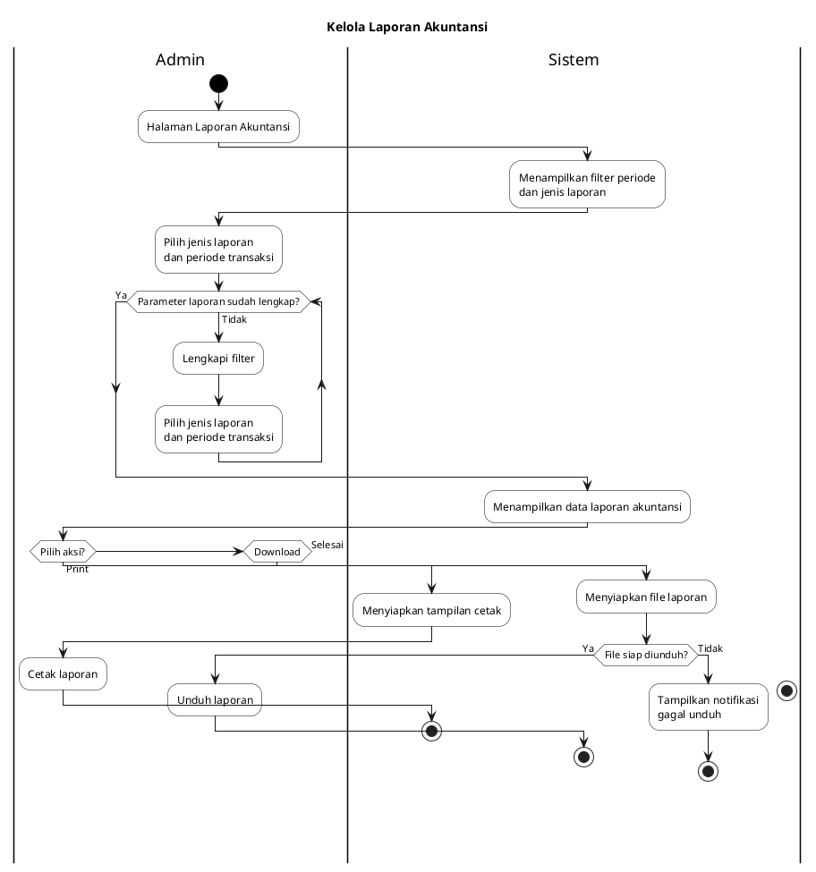
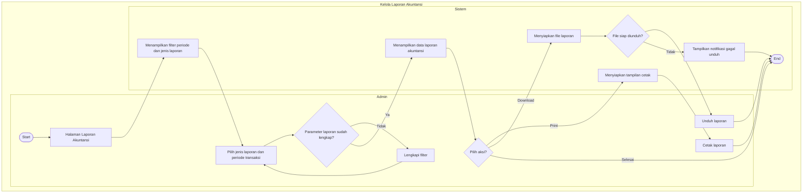

# Activity Diagram Laporan Akuntansi

## 1. Deskripsi
Dokumentasi ini menggambarkan alur proses bisnis pada submenu `Laporan Akuntansi` dengan format swimlane seperti contoh, sehingga aktivitas `Admin` dan `Sistem` terlihat terpisah secara visual. Proses dimulai saat admin membuka halaman laporan, memilih parameter laporan, lalu sistem menampilkan hasil dan menyiapkan proses cetak atau unduh.

## 2. Aktor yang Terlibat
- Admin
- Sistem Dashboard Wajira

## 3. Alur Proses
1. Admin membuka submenu `Laporan Akuntansi`.
2. Sistem menampilkan halaman laporan beserta filter periode dan jenis laporan default.
3. Admin memilih jenis laporan dan periode transaksi.
4. Sistem memeriksa kelengkapan parameter laporan.
5. Jika parameter lengkap, sistem memuat data laporan akuntansi.
6. Jika data berhasil dimuat, sistem menampilkan hasil laporan untuk ditinjau admin.
7. Admin dapat memilih aksi lanjutan berupa cetak, unduh, atau mengakhiri proses.
8. Jika admin memilih unduh, sistem menyiapkan file laporan dan memberi hasil berhasil atau gagal.

## 4. XML Activity Diagram

```xml
<mxfile host="app.diagrams.net" modified="2026-07-04T00:00:00.000Z" agent="Codex" version="27.0.5">
  <diagram id="activity-laporan-akuntansi" name="Activity Diagram">
    <mxGraphModel dx="1486" dy="932" grid="1" gridSize="10" guides="1" tooltips="1" connect="1" arrows="1" fold="1" page="1" pageScale="1" pageWidth="1169" pageHeight="1654" math="0" shadow="0">
      <root>
        <mxCell id="0" />
        <mxCell id="1" parent="0" />
        <mxCell id="2" value="Kelola Laporan Akuntansi" style="swimlane;html=1;startSize=34;horizontal=0;rounded=0;swimlaneLine=1;fillColor=#ffffff;strokeColor=#000000;fontStyle=1;" vertex="1" parent="1">
          <mxGeometry x="120" y="40" width="720" height="1180" as="geometry" />
        </mxCell>
        <mxCell id="3" value="Admin" style="swimlane;html=1;startSize=28;horizontal=0;rounded=0;swimlaneLine=1;fillColor=#ffffff;strokeColor=#000000;fontStyle=1;" vertex="1" parent="2">
          <mxGeometry x="0" y="34" width="340" height="1146" as="geometry" />
        </mxCell>
        <mxCell id="4" value="Sistem" style="swimlane;html=1;startSize=28;horizontal=0;rounded=0;swimlaneLine=1;fillColor=#ffffff;strokeColor=#000000;fontStyle=1;" vertex="1" parent="2">
          <mxGeometry x="340" y="34" width="380" height="1146" as="geometry" />
        </mxCell>
        <mxCell id="5" value="" style="ellipse;html=1;aspect=fixed;fillColor=#000000;strokeColor=#000000;" vertex="1" parent="3">
          <mxGeometry x="145" y="34" width="24" height="24" as="geometry" />
        </mxCell>
        <mxCell id="6" value="Halaman Laporan&#xa;Akuntansi" style="rounded=1;whiteSpace=wrap;html=1;arcSize=18;fillColor=#ffffff;strokeColor=#000000;" vertex="1" parent="3">
          <mxGeometry x="60" y="90" width="190" height="54" as="geometry" />
        </mxCell>
        <mxCell id="7" value="Menampilkan filter periode&#xa;dan jenis laporan" style="rounded=1;whiteSpace=wrap;html=1;arcSize=18;fillColor=#ffffff;strokeColor=#000000;" vertex="1" parent="4">
          <mxGeometry x="70" y="90" width="220" height="54" as="geometry" />
        </mxCell>
        <mxCell id="8" value="Pilih jenis laporan&#xa;dan periode transaksi" style="rounded=1;whiteSpace=wrap;html=1;arcSize=18;fillColor=#ffffff;strokeColor=#000000;" vertex="1" parent="3">
          <mxGeometry x="60" y="200" width="190" height="60" as="geometry" />
        </mxCell>
        <mxCell id="9" value="Parameter laporan&#xa;sudah lengkap?" style="rhombus;whiteSpace=wrap;html=1;fillColor=#ffffff;strokeColor=#000000;" vertex="1" parent="3">
          <mxGeometry x="100" y="320" width="110" height="90" as="geometry" />
        </mxCell>
        <mxCell id="10" value="Lengkapi filter" style="rounded=1;whiteSpace=wrap;html=1;arcSize=18;fillColor=#ffffff;strokeColor=#000000;" vertex="1" parent="3">
          <mxGeometry x="75" y="450" width="160" height="54" as="geometry" />
        </mxCell>
        <mxCell id="11" value="Menampilkan data&#xa;laporan akuntansi" style="rounded=1;whiteSpace=wrap;html=1;arcSize=18;fillColor=#ffffff;strokeColor=#000000;" vertex="1" parent="4">
          <mxGeometry x="70" y="320" width="220" height="54" as="geometry" />
        </mxCell>
        <mxCell id="12" value="Pilih aksi" style="rhombus;whiteSpace=wrap;html=1;fillColor=#ffffff;strokeColor=#000000;" vertex="1" parent="3">
          <mxGeometry x="100" y="580" width="110" height="90" as="geometry" />
        </mxCell>
        <mxCell id="13" value="Cetak laporan" style="rounded=1;whiteSpace=wrap;html=1;arcSize=18;fillColor=#ffffff;strokeColor=#000000;" vertex="1" parent="3">
          <mxGeometry x="75" y="735" width="160" height="54" as="geometry" />
        </mxCell>
        <mxCell id="14" value="Menyiapkan tampilan&#xa;cetak" style="rounded=1;whiteSpace=wrap;html=1;arcSize=18;fillColor=#ffffff;strokeColor=#000000;" vertex="1" parent="4">
          <mxGeometry x="70" y="735" width="220" height="54" as="geometry" />
        </mxCell>
        <mxCell id="15" value="Menyiapkan file&#xa;laporan" style="rounded=1;whiteSpace=wrap;html=1;arcSize=18;fillColor=#ffffff;strokeColor=#000000;" vertex="1" parent="4">
          <mxGeometry x="70" y="840" width="220" height="54" as="geometry" />
        </mxCell>
        <mxCell id="16" value="File siap&#xa;diunduh?" style="rhombus;whiteSpace=wrap;html=1;fillColor=#ffffff;strokeColor=#000000;" vertex="1" parent="4">
          <mxGeometry x="125" y="940" width="110" height="90" as="geometry" />
        </mxCell>
        <mxCell id="17" value="Unduh laporan" style="rounded=1;whiteSpace=wrap;html=1;arcSize=18;fillColor=#ffffff;strokeColor=#000000;" vertex="1" parent="3">
          <mxGeometry x="75" y="950" width="160" height="54" as="geometry" />
        </mxCell>
        <mxCell id="18" value="Tampilkan notifikasi&#xa;gagal unduh" style="rounded=1;whiteSpace=wrap;html=1;arcSize=18;fillColor=#ffffff;strokeColor=#000000;" vertex="1" parent="4">
          <mxGeometry x="70" y="1065" width="220" height="54" as="geometry" />
        </mxCell>
        <mxCell id="19" value="" style="ellipse;html=1;aspect=fixed;fillColor=#000000;strokeColor=#000000;" vertex="1" parent="4">
          <mxGeometry x="159" y="1140" width="26" height="26" as="geometry" />
        </mxCell>
        <mxCell id="20" value="" style="ellipse;html=1;aspect=fixed;fillColor=#ffffff;strokeColor=#000000;" vertex="1" parent="4">
          <mxGeometry x="153" y="1134" width="38" height="38" as="geometry" />
        </mxCell>
        <mxCell id="21" style="edgeStyle=orthogonalEdgeStyle;rounded=0;orthogonalLoop=1;jettySize=auto;html=1;endArrow=block;endFill=1;strokeColor=#000000;" edge="1" parent="2" source="5" target="6">
          <mxGeometry relative="1" as="geometry" />
        </mxCell>
        <mxCell id="22" style="edgeStyle=orthogonalEdgeStyle;rounded=0;orthogonalLoop=1;jettySize=auto;html=1;endArrow=block;endFill=1;strokeColor=#000000;" edge="1" parent="2" source="6" target="7">
          <mxGeometry relative="1" as="geometry" />
        </mxCell>
        <mxCell id="23" style="edgeStyle=orthogonalEdgeStyle;rounded=0;orthogonalLoop=1;jettySize=auto;html=1;endArrow=block;endFill=1;strokeColor=#000000;" edge="1" parent="2" source="7" target="8">
          <mxGeometry relative="1" as="geometry" />
        </mxCell>
        <mxCell id="24" style="edgeStyle=orthogonalEdgeStyle;rounded=0;orthogonalLoop=1;jettySize=auto;html=1;endArrow=block;endFill=1;strokeColor=#000000;" edge="1" parent="2" source="8" target="9">
          <mxGeometry relative="1" as="geometry" />
        </mxCell>
        <mxCell id="25" value="[Tidak]" style="edgeStyle=orthogonalEdgeStyle;rounded=0;orthogonalLoop=1;jettySize=auto;html=1;endArrow=block;endFill=1;strokeColor=#000000;" edge="1" parent="2" source="9" target="10">
          <mxGeometry relative="1" as="geometry" />
        </mxCell>
        <mxCell id="26" style="edgeStyle=orthogonalEdgeStyle;rounded=0;orthogonalLoop=1;jettySize=auto;html=1;endArrow=block;endFill=1;strokeColor=#000000;" edge="1" parent="2" source="10" target="8">
          <mxGeometry relative="1" as="geometry">
            <Array as="points">
              <mxPoint x="160" y="520" />
              <mxPoint x="160" y="240" />
            </Array>
          </mxGeometry>
        </mxCell>
        <mxCell id="27" value="[Ya]" style="edgeStyle=orthogonalEdgeStyle;rounded=0;orthogonalLoop=1;jettySize=auto;html=1;endArrow=block;endFill=1;strokeColor=#000000;" edge="1" parent="2" source="9" target="11">
          <mxGeometry relative="1" as="geometry" />
        </mxCell>
        <mxCell id="28" style="edgeStyle=orthogonalEdgeStyle;rounded=0;orthogonalLoop=1;jettySize=auto;html=1;endArrow=block;endFill=1;strokeColor=#000000;" edge="1" parent="2" source="11" target="12">
          <mxGeometry relative="1" as="geometry" />
        </mxCell>
        <mxCell id="29" value="[Print]" style="edgeStyle=orthogonalEdgeStyle;rounded=0;orthogonalLoop=1;jettySize=auto;html=1;endArrow=block;endFill=1;strokeColor=#000000;" edge="1" parent="2" source="12" target="14">
          <mxGeometry relative="1" as="geometry">
            <Array as="points">
              <mxPoint x="310" y="625" />
              <mxPoint x="410" y="625" />
            </Array>
          </mxGeometry>
        </mxCell>
        <mxCell id="30" style="edgeStyle=orthogonalEdgeStyle;rounded=0;orthogonalLoop=1;jettySize=auto;html=1;endArrow=block;endFill=1;strokeColor=#000000;" edge="1" parent="2" source="14" target="13">
          <mxGeometry relative="1" as="geometry" />
        </mxCell>
        <mxCell id="31" value="[Download]" style="edgeStyle=orthogonalEdgeStyle;rounded=0;orthogonalLoop=1;jettySize=auto;html=1;endArrow=block;endFill=1;strokeColor=#000000;" edge="1" parent="2" source="12" target="15">
          <mxGeometry relative="1" as="geometry">
            <Array as="points">
              <mxPoint x="310" y="625" />
              <mxPoint x="410" y="625" />
            </Array>
          </mxGeometry>
        </mxCell>
        <mxCell id="32" value="[Selesai]" style="edgeStyle=orthogonalEdgeStyle;rounded=0;orthogonalLoop=1;jettySize=auto;html=1;endArrow=block;endFill=1;strokeColor=#000000;" edge="1" parent="2" source="12" target="20">
          <mxGeometry relative="1" as="geometry">
            <Array as="points">
              <mxPoint x="245" y="740" />
              <mxPoint x="310" y="740" />
              <mxPoint x="493" y="740" />
              <mxPoint x="493" y="1153" />
            </Array>
          </mxGeometry>
        </mxCell>
        <mxCell id="33" style="edgeStyle=orthogonalEdgeStyle;rounded=0;orthogonalLoop=1;jettySize=auto;html=1;endArrow=block;endFill=1;strokeColor=#000000;" edge="1" parent="2" source="15" target="16">
          <mxGeometry relative="1" as="geometry" />
        </mxCell>
        <mxCell id="34" value="[Ya]" style="edgeStyle=orthogonalEdgeStyle;rounded=0;orthogonalLoop=1;jettySize=auto;html=1;endArrow=block;endFill=1;strokeColor=#000000;" edge="1" parent="2" source="16" target="17">
          <mxGeometry relative="1" as="geometry">
            <Array as="points">
              <mxPoint x="410" y="985" />
              <mxPoint x="310" y="985" />
            </Array>
          </mxGeometry>
        </mxCell>
        <mxCell id="35" value="[Tidak]" style="edgeStyle=orthogonalEdgeStyle;rounded=0;orthogonalLoop=1;jettySize=auto;html=1;endArrow=block;endFill=1;strokeColor=#000000;" edge="1" parent="2" source="16" target="18">
          <mxGeometry relative="1" as="geometry">
            <Array as="points">
              <mxPoint x="493" y="985" />
              <mxPoint x="493" y="1092" />
            </Array>
          </mxGeometry>
        </mxCell>
        <mxCell id="36" style="edgeStyle=orthogonalEdgeStyle;rounded=0;orthogonalLoop=1;jettySize=auto;html=1;endArrow=block;endFill=1;strokeColor=#000000;" edge="1" parent="2" source="13" target="20">
          <mxGeometry relative="1" as="geometry">
            <Array as="points">
              <mxPoint x="310" y="762" />
              <mxPoint x="493" y="762" />
              <mxPoint x="493" y="1153" />
            </Array>
          </mxGeometry>
        </mxCell>
        <mxCell id="37" style="edgeStyle=orthogonalEdgeStyle;rounded=0;orthogonalLoop=1;jettySize=auto;html=1;endArrow=block;endFill=1;strokeColor=#000000;" edge="1" parent="2" source="17" target="20">
          <mxGeometry relative="1" as="geometry">
            <Array as="points">
              <mxPoint x="310" y="977" />
              <mxPoint x="493" y="977" />
              <mxPoint x="493" y="1153" />
            </Array>
          </mxGeometry>
        </mxCell>
        <mxCell id="38" style="edgeStyle=orthogonalEdgeStyle;rounded=0;orthogonalLoop=1;jettySize=auto;html=1;endArrow=block;endFill=1;strokeColor=#000000;" edge="1" parent="2" source="18" target="20">
          <mxGeometry relative="1" as="geometry" />
        </mxCell>
      </root>
    </mxGraphModel>
  </diagram>
</mxfile>
```

## 5. PlantUML Activity Diagram



## 6. Mermaid Activity Diagram



## 7. Catatan Validasi

- Ketiga format sekarang memakai gaya swimlane `Admin` dan `Sistem` agar visualnya mendekati contoh gambar.
- Decision `Parameter laporan sudah lengkap?` ditempatkan di sisi `Admin` karena keputusan ini dipicu oleh kelengkapan input yang dipilih admin.
- Decision `File siap diunduh?` ditempatkan di sisi `Sistem` karena validasi kesiapan file merupakan hasil proses sistem.
- Jalur akhir dibuat sederhana seperti contoh: setelah print, download berhasil, download gagal, atau selesai tanpa aksi lanjutan, proses langsung menuju `End`.
- Detail teknis seperti endpoint API, nama fungsi, struktur data internal, dan state management tetap tidak dimasukkan agar diagram tetap fokus pada proses bisnis.
