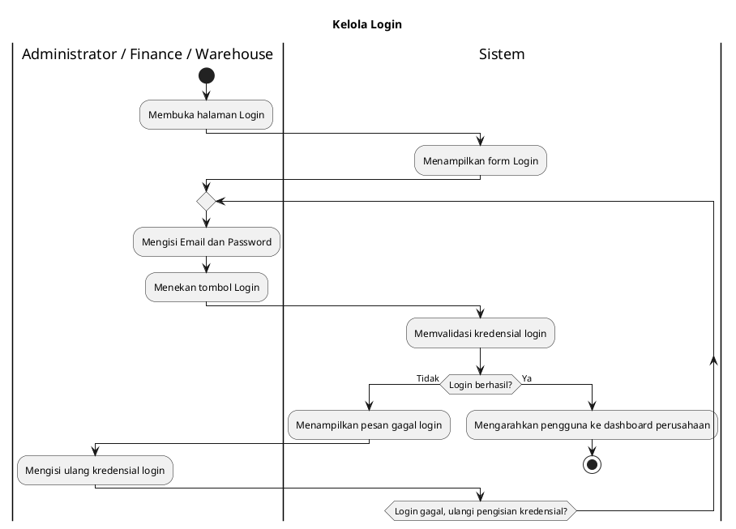
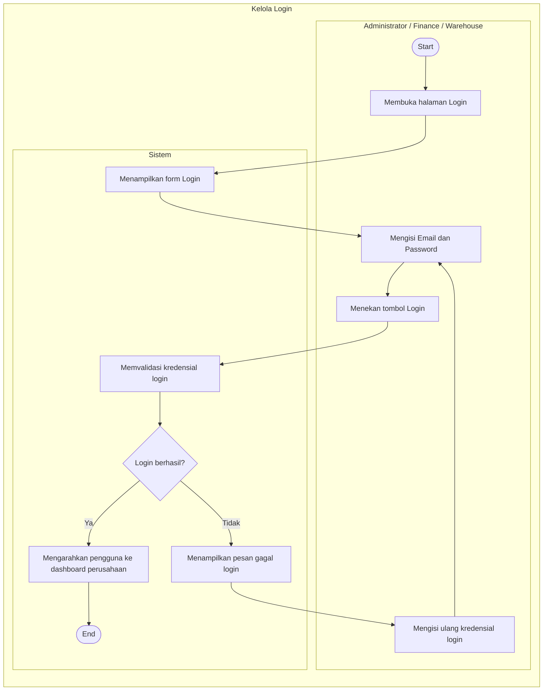

# Activity Diagram Login

## 1. Deskripsi
Activity Diagram ini menggambarkan alur aktivitas dan proses bisnis secara garis besar pada modul Login. Proses dimulai ketika pengguna (Administrator, Finance, atau Warehouse) membuka halaman login, mengisi kredensial, dan sistem melakukan validasi. Diagram ini menjelaskan urutan aktivitas fungsional antara aktor dan sistem, termasuk penanganan kondisi login gagal dan berhasil, hingga pengguna diarahkan ke dashboard perusahaan. Diagram difokuskan pada alur bisnis dan tidak mencakup detail teknis.

## 2. Aktor yang Terlibat
- Administrator / Finance / Warehouse
- Sistem

## 3. Alur Proses
1. Administrator / Finance / Warehouse membuka halaman Login.
2. Sistem menampilkan form Login.
3. Pengguna mengisi Email dan Password.
4. Pengguna menekan tombol Login.
5. Sistem memvalidasi kredensial login.
6. Sistem mengecek apakah login berhasil.
7. Jika login gagal:
   - Sistem menampilkan pesan gagal login.
   - Pengguna mengisi ulang kredensial login.
   - Alur kembali ke pengisian Email dan Password.
8. Jika login berhasil:
   - Sistem mengarahkan pengguna ke dashboard perusahaan.
9. Proses selesai.

## 4. XML Activity Diagram

```xml
<mxfile host="app.diagrams.net" modified="2026-07-04T00:00:00.000Z" agent="Codex" version="27.0.5">
  <diagram id="activity-login" name="Activity Diagram">
    <mxGraphModel dx="1178" dy="633" grid="1" gridSize="10" guides="1" tooltips="1" connect="1" arrows="1" fold="1" page="1" pageScale="1" pageWidth="827" pageHeight="1169" math="0" shadow="0">
      <root>
        <mxCell id="0" />
        <mxCell id="1" parent="0" />
        <mxCell id="2" parent="1" style="swimlane;html=1;startSize=30;horizontal=1;rounded=0;swimlaneLine=1;fillColor=#ffffff;strokeColor=#000000;fontStyle=1;" value="Kelola Login" vertex="1">
          <mxGeometry height="890" width="760" x="80" y="40" as="geometry" />
        </mxCell>
        <mxCell id="3" parent="2" style="swimlane;html=1;startSize=30;horizontal=1;rounded=0;swimlaneLine=1;fillColor=#ffffff;strokeColor=#000000;fontStyle=1;fontSize=12;" value="Administrator / Finance / Warehouse" vertex="1">
          <mxGeometry height="860" width="380" y="30" as="geometry" />
        </mxCell>
        <mxCell id="10" parent="3" style="ellipse;html=1;aspect=fixed;fillColor=#000000;strokeColor=#000000;" value="" vertex="1">
          <mxGeometry height="30" width="30" x="175" y="40" as="geometry" />
        </mxCell>
        <mxCell id="11" parent="3" style="rounded=1;whiteSpace=wrap;html=1;arcSize=18;fillColor=#ffffff;strokeColor=#000000;" value="Membuka halaman Login" vertex="1">
          <mxGeometry height="50" width="150" x="115" y="100" as="geometry" />
        </mxCell>
        <mxCell id="13" parent="3" style="rounded=1;whiteSpace=wrap;html=1;arcSize=18;fillColor=#ffffff;strokeColor=#000000;" value="Mengisi Email&lt;br&gt;dan Password" vertex="1">
          <mxGeometry height="50" width="150" x="115" y="240" as="geometry" />
        </mxCell>
        <mxCell id="14" parent="3" style="rounded=1;whiteSpace=wrap;html=1;arcSize=18;fillColor=#ffffff;strokeColor=#000000;" value="Menekan tombol Login" vertex="1">
          <mxGeometry height="50" width="150" x="115" y="320" as="geometry" />
        </mxCell>
        <mxCell id="18" parent="3" style="rounded=1;whiteSpace=wrap;html=1;arcSize=18;fillColor=#ffffff;strokeColor=#000000;" value="Mengisi ulang&lt;br&gt;kredensial login" vertex="1">
          <mxGeometry height="50" width="150" x="115" y="560" as="geometry" />
        </mxCell>
        <mxCell id="4" parent="2" style="swimlane;html=1;startSize=30;horizontal=1;rounded=0;swimlaneLine=1;fillColor=#ffffff;strokeColor=#000000;fontStyle=1;fontSize=12;" value="Sistem" vertex="1">
          <mxGeometry height="860" width="380" x="380" y="30" as="geometry" />
        </mxCell>
        <mxCell id="12" parent="4" style="rounded=1;whiteSpace=wrap;html=1;arcSize=18;fillColor=#ffffff;strokeColor=#000000;" value="Menampilkan form Login" vertex="1">
          <mxGeometry height="50" width="150" x="115" y="160" as="geometry" />
        </mxCell>
        <mxCell id="15" parent="4" style="rounded=1;whiteSpace=wrap;html=1;arcSize=18;fillColor=#ffffff;strokeColor=#000000;" value="Memvalidasi&lt;br&gt;kredensial login" vertex="1">
          <mxGeometry height="50" width="150" x="115" y="400" as="geometry" />
        </mxCell>
        <mxCell id="16" parent="4" style="rhombus;whiteSpace=wrap;html=1;fillColor=#ffffff;strokeColor=#000000;" value="Login berhasil?" vertex="1">
          <mxGeometry height="60" width="130" x="125" y="480" as="geometry" />
        </mxCell>
        <mxCell id="17" parent="4" style="rounded=1;whiteSpace=wrap;html=1;arcSize=18;fillColor=#ffffff;strokeColor=#000000;" value="Menampilkan pesan&lt;br&gt;gagal login" vertex="1">
          <mxGeometry height="50" width="150" x="20" y="560" as="geometry" />
        </mxCell>
        <mxCell id="24" parent="4" style="rounded=1;whiteSpace=wrap;html=1;arcSize=18;fillColor=#ffffff;strokeColor=#000000;" value="Mengarahkan pengguna&lt;br&gt;ke dashboard perusahaan" vertex="1">
          <mxGeometry height="50" width="170" x="105" y="640" as="geometry" />
        </mxCell>
        <mxCell id="30" edge="1" parent="2" source="10" style="edgeStyle=orthogonalEdgeStyle;rounded=0;orthogonalLoop=1;jettySize=auto;html=1;endArrow=block;endFill=1;strokeColor=#000000;" target="11">
          <mxGeometry relative="1" as="geometry" />
        </mxCell>
        <mxCell id="31" edge="1" parent="2" source="11" style="edgeStyle=orthogonalEdgeStyle;rounded=0;orthogonalLoop=1;jettySize=auto;html=1;endArrow=block;endFill=1;strokeColor=#000000;" target="12">
          <mxGeometry relative="1" as="geometry" />
        </mxCell>
        <mxCell id="32" edge="1" parent="2" source="12" style="edgeStyle=orthogonalEdgeStyle;rounded=0;orthogonalLoop=1;jettySize=auto;html=1;endArrow=block;endFill=1;strokeColor=#000000;" target="13">
          <mxGeometry relative="1" as="geometry" />
        </mxCell>
        <mxCell id="33" edge="1" parent="2" source="13" style="edgeStyle=orthogonalEdgeStyle;rounded=0;orthogonalLoop=1;jettySize=auto;html=1;endArrow=block;endFill=1;strokeColor=#000000;" target="14">
          <mxGeometry relative="1" as="geometry" />
        </mxCell>
        <mxCell id="34" edge="1" parent="2" source="14" style="edgeStyle=orthogonalEdgeStyle;rounded=0;orthogonalLoop=1;jettySize=auto;html=1;endArrow=block;endFill=1;strokeColor=#000000;" target="15">
          <mxGeometry relative="1" as="geometry" />
        </mxCell>
        <mxCell id="35" edge="1" parent="2" source="15" style="edgeStyle=orthogonalEdgeStyle;rounded=0;orthogonalLoop=1;jettySize=auto;html=1;endArrow=block;endFill=1;strokeColor=#000000;" target="16">
          <mxGeometry relative="1" as="geometry" />
        </mxCell>
        <mxCell id="36" edge="1" parent="2" source="16" style="edgeStyle=orthogonalEdgeStyle;rounded=0;orthogonalLoop=1;jettySize=auto;html=1;endArrow=block;endFill=1;strokeColor=#000000;" target="17" value="Tidak">
          <mxGeometry relative="1" as="geometry">
            <Array as="points">
              <mxPoint x="475" y="510" />
              <mxPoint x="475" y="585" />
            </Array>
          </mxGeometry>
        </mxCell>
        <mxCell id="37" edge="1" parent="2" source="17" style="edgeStyle=orthogonalEdgeStyle;rounded=0;orthogonalLoop=1;jettySize=auto;html=1;endArrow=block;endFill=1;strokeColor=#000000;" target="18">
          <mxGeometry relative="1" as="geometry" />
        </mxCell>
        <mxCell id="38" edge="1" parent="2" source="18" style="edgeStyle=orthogonalEdgeStyle;rounded=0;orthogonalLoop=1;jettySize=auto;html=1;endArrow=block;endFill=1;strokeColor=#000000;" target="13">
          <mxGeometry relative="1" as="geometry">
            <Array as="points">
              <mxPoint x="60" y="585" />
              <mxPoint x="60" y="265" />
            </Array>
          </mxGeometry>
        </mxCell>
        <mxCell id="39" edge="1" parent="2" source="16" style="edgeStyle=orthogonalEdgeStyle;rounded=0;orthogonalLoop=1;jettySize=auto;html=1;endArrow=block;endFill=1;strokeColor=#000000;" value="Ya">
          <mxGeometry relative="1" as="geometry">
            <Array as="points">
              <mxPoint x="570" y="510" />
              <mxPoint x="570" y="665" />
            </Array>
            <mxPoint x="570" y="670" as="targetPoint" />
          </mxGeometry>
        </mxCell>
        <mxCell id="w9C48_ve1g2sG0_G9OnN-45" edge="1" parent="2" source="24" style="edgeStyle=orthogonalEdgeStyle;rounded=0;orthogonalLoop=1;jettySize=auto;html=1;endArrow=block;endFill=1;strokeColor=#000000;" target="26" value="">
          <mxGeometry relative="1" as="geometry">
            <mxPoint x="715" y="900" as="sourcePoint" />
            <mxPoint x="715" y="950" as="targetPoint" />
          </mxGeometry>
        </mxCell>
        <mxCell id="25" parent="2" style="ellipse;html=1;aspect=fixed;fillColor=#ffffff;strokeColor=#000000;strokeWidth=2;" value="" vertex="1">
          <mxGeometry height="30" width="30" x="555" y="780" as="geometry" />
        </mxCell>
        <mxCell id="26" parent="2" style="ellipse;html=1;aspect=fixed;fillColor=#000000;strokeColor=#000000;" value="" vertex="1">
          <mxGeometry height="18" width="18" x="561" y="786" as="geometry" />
        </mxCell>
      </root>
    </mxGraphModel>
  </diagram>
</mxfile>
```

## 5. PlantUML Activity Diagram



## 6. Mermaid Activity Diagram



## 7. Catatan Validasi
- Ketiga format diagram, yaitu XML, PlantUML, dan Mermaid, menggambarkan alur Login yang sama secara konsisten.
- Actor `Administrator / Finance / Warehouse` digabung menjadi satu swimlane karena ketiganya memiliki alur proses Login yang persis sama.
- Decision `Login berhasil?` berada pada sisi sistem karena validasi kredensial merupakan proses yang dilakukan oleh sistem.
- Jika Login gagal, sistem menampilkan pesan kesalahan dan pengguna dapat mengisi ulang kredensial.
- Jika Login berhasil, sistem mengarahkan pengguna ke dashboard perusahaan.
- Activity Diagram ini hanya menjelaskan proses bisnis secara garis besar dari perspektif pengguna dan sistem.
- Detail teknis seperti endpoint API, Controller, Service, Repository, Database, Axios, React Query, Laravel, dan Next.js sengaja tidak dimasukkan karena elemen teknis tersebut merupakan ranah dari Sequence Diagram.
