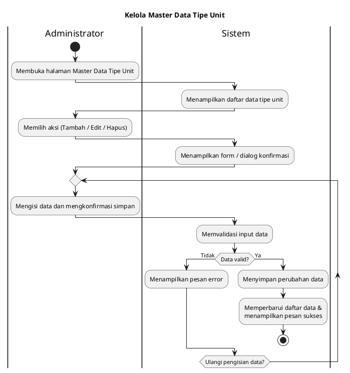
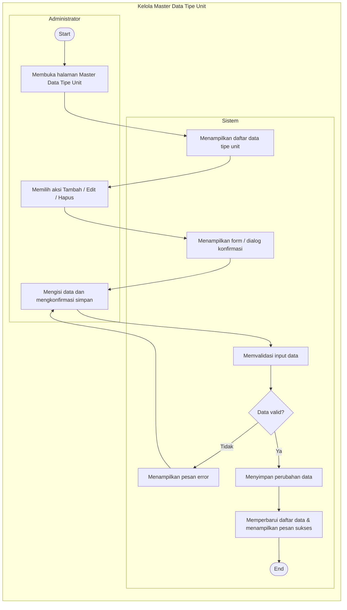

# Activity Diagram Master Data Tipe Unit

## 1. Deskripsi
Activity Diagram ini menggambarkan alur proses bisnis secara garis besar pada modul pengelolaan **Master Data Tipe Unit**. Proses mencakup aktivitas Administrator ketika melihat daftar data tipe unit, memilih aksi pengelolaan (seperti Tambah, Edit, atau Hapus data), hingga sistem memvalidasi dan menyimpan perubahan. Diagram ini disusun secara sekuensial dan fokus pada alur *User Flow* bisnis tanpa melibatkan elemen teknis internal.

## 2. Aktor yang Terlibat
- Administrator
- Sistem

## 3. Alur Proses
1. Administrator membuka halaman Master Data Tipe Unit.
2. Sistem menampilkan daftar data tipe unit.
3. Administrator memilih aksi pengelolaan (Tambah / Edit / Hapus).
4. Sistem menampilkan form isian atau dialog konfirmasi sesuai aksi yang dipilih.
5. Administrator mengisi data dan mengkonfirmasi penyimpanan.
6. Sistem memvalidasi input data dari Administrator.
7. Sistem mengecek apakah data valid.
8. Jika tidak valid (gagal):
   - Sistem menampilkan pesan error.
   - Alur kembali ke pengisian data oleh Administrator.
9. Jika valid (berhasil):
   - Sistem menyimpan perubahan data.
   - Sistem memperbarui daftar data tipe unit dan menampilkan pesan sukses.
10. Proses selesai.

## 4. XML Activity Diagram

```xml
<mxfile host="app.diagrams.net" modified="2026-07-04T00:00:00.000Z" agent="Codex" version="27.0.5">
  <diagram id="activity-master-tipe-unit" name="Activity Diagram">
    <mxGraphModel dx="1178" dy="633" grid="1" gridSize="10" guides="1" tooltips="1" connect="1" arrows="1" fold="1" page="1" pageScale="1" pageWidth="827" pageHeight="1169" math="0" shadow="0">
      <root>
        <mxCell id="0" />
        <mxCell id="1" parent="0" />
        <mxCell id="2" parent="1" style="swimlane;html=1;startSize=30;horizontal=1;rounded=0;swimlaneLine=1;fillColor=#ffffff;strokeColor=#000000;fontStyle=1;" value="Kelola Master Data Tipe Unit" vertex="1">
          <mxGeometry height="1000" width="760" x="80" y="40" as="geometry" />
        </mxCell>
        <mxCell id="3" parent="2" style="swimlane;html=1;startSize=30;horizontal=1;rounded=0;swimlaneLine=1;fillColor=#ffffff;strokeColor=#000000;fontStyle=1;fontSize=12;" value="Administrator" vertex="1">
          <mxGeometry height="970" width="380" y="30" as="geometry" />
        </mxCell>
        
        <!-- Administrator Nodes -->
        <mxCell id="10" parent="3" style="ellipse;html=1;aspect=fixed;fillColor=#000000;strokeColor=#000000;" value="" vertex="1">
          <mxGeometry height="30" width="30" x="175" y="40" as="geometry" />
        </mxCell>
        <mxCell id="11" parent="3" style="rounded=1;whiteSpace=wrap;html=1;arcSize=18;fillColor=#ffffff;strokeColor=#000000;" value="Membuka halaman&lt;br&gt;Master Data Tipe Unit" vertex="1">
          <mxGeometry height="50" width="150" x="115" y="100" as="geometry" />
        </mxCell>
        <mxCell id="13" parent="3" style="rounded=1;whiteSpace=wrap;html=1;arcSize=18;fillColor=#ffffff;strokeColor=#000000;" value="Memilih aksi&lt;br&gt;(Tambah / Edit / Hapus)" vertex="1">
          <mxGeometry height="50" width="150" x="115" y="260" as="geometry" />
        </mxCell>
        <mxCell id="14" parent="3" style="rounded=1;whiteSpace=wrap;html=1;arcSize=18;fillColor=#ffffff;strokeColor=#000000;" value="Mengisi data dan&lt;br&gt;mengkonfirmasi simpan" vertex="1">
          <mxGeometry height="50" width="150" x="115" y="420" as="geometry" />
        </mxCell>
        
        <!-- Sistem Nodes -->
        <mxCell id="4" parent="2" style="swimlane;html=1;startSize=30;horizontal=1;rounded=0;swimlaneLine=1;fillColor=#ffffff;strokeColor=#000000;fontStyle=1;fontSize=12;" value="Sistem" vertex="1">
          <mxGeometry height="970" width="380" x="380" y="30" as="geometry" />
        </mxCell>
        <mxCell id="12" parent="4" style="rounded=1;whiteSpace=wrap;html=1;arcSize=18;fillColor=#ffffff;strokeColor=#000000;" value="Menampilkan daftar&lt;br&gt;data tipe unit" vertex="1">
          <mxGeometry height="50" width="150" x="115" y="180" as="geometry" />
        </mxCell>
        <mxCell id="15" parent="4" style="rounded=1;whiteSpace=wrap;html=1;arcSize=18;fillColor=#ffffff;strokeColor=#000000;" value="Menampilkan form /&lt;br&gt;dialog konfirmasi" vertex="1">
          <mxGeometry height="50" width="150" x="115" y="340" as="geometry" />
        </mxCell>
        <mxCell id="16" parent="4" style="rounded=1;whiteSpace=wrap;html=1;arcSize=18;fillColor=#ffffff;strokeColor=#000000;" value="Memvalidasi input data" vertex="1">
          <mxGeometry height="50" width="150" x="115" y="500" as="geometry" />
        </mxCell>
        <mxCell id="17" parent="4" style="rhombus;whiteSpace=wrap;html=1;fillColor=#ffffff;strokeColor=#000000;" value="Data valid?" vertex="1">
          <mxGeometry height="60" width="130" x="125" y="580" as="geometry" />
        </mxCell>
        <mxCell id="18" parent="4" style="rounded=1;whiteSpace=wrap;html=1;arcSize=18;fillColor=#ffffff;strokeColor=#000000;" value="Menampilkan&lt;br&gt;pesan error" vertex="1">
          <mxGeometry height="50" width="150" x="20" y="670" as="geometry" />
        </mxCell>
        <mxCell id="19" parent="4" style="rounded=1;whiteSpace=wrap;html=1;arcSize=18;fillColor=#ffffff;strokeColor=#000000;" value="Menyimpan&lt;br&gt;perubahan data" vertex="1">
          <mxGeometry height="50" width="150" x="180" y="760" as="geometry" />
        </mxCell>
        <mxCell id="20" parent="4" style="rounded=1;whiteSpace=wrap;html=1;arcSize=18;fillColor=#ffffff;strokeColor=#000000;" value="Memperbarui daftar data &amp;amp;&lt;br&gt;menampilkan pesan sukses" vertex="1">
          <mxGeometry height="50" width="170" x="170" y="840" as="geometry" />
        </mxCell>
        <mxCell id="21" parent="4" style="ellipse;html=1;aspect=fixed;fillColor=#ffffff;strokeColor=#000000;strokeWidth=2;" value="" vertex="1">
          <mxGeometry height="30" width="30" x="240" y="910" as="geometry" />
        </mxCell>
        <mxCell id="22" parent="4" style="ellipse;html=1;aspect=fixed;fillColor=#000000;strokeColor=#000000;" value="" vertex="1">
          <mxGeometry height="18" width="18" x="246" y="916" as="geometry" />
        </mxCell>

        <!-- Edges -->
        <mxCell id="30" edge="1" parent="2" source="10" target="11" style="edgeStyle=orthogonalEdgeStyle;rounded=0;orthogonalLoop=1;jettySize=auto;html=1;endArrow=block;endFill=1;strokeColor=#000000;">
          <mxGeometry relative="1" as="geometry" />
        </mxCell>
        <mxCell id="31" edge="1" parent="2" source="11" target="12" style="edgeStyle=orthogonalEdgeStyle;rounded=0;orthogonalLoop=1;jettySize=auto;html=1;endArrow=block;endFill=1;strokeColor=#000000;">
          <mxGeometry relative="1" as="geometry" />
        </mxCell>
        <mxCell id="32" edge="1" parent="2" source="12" target="13" style="edgeStyle=orthogonalEdgeStyle;rounded=0;orthogonalLoop=1;jettySize=auto;html=1;endArrow=block;endFill=1;strokeColor=#000000;">
          <mxGeometry relative="1" as="geometry" />
        </mxCell>
        <mxCell id="33" edge="1" parent="2" source="13" target="15" style="edgeStyle=orthogonalEdgeStyle;rounded=0;orthogonalLoop=1;jettySize=auto;html=1;endArrow=block;endFill=1;strokeColor=#000000;">
          <mxGeometry relative="1" as="geometry" />
        </mxCell>
        <mxCell id="34" edge="1" parent="2" source="15" target="14" style="edgeStyle=orthogonalEdgeStyle;rounded=0;orthogonalLoop=1;jettySize=auto;html=1;endArrow=block;endFill=1;strokeColor=#000000;">
          <mxGeometry relative="1" as="geometry" />
        </mxCell>
        <mxCell id="35" edge="1" parent="2" source="14" target="16" style="edgeStyle=orthogonalEdgeStyle;rounded=0;orthogonalLoop=1;jettySize=auto;html=1;endArrow=block;endFill=1;strokeColor=#000000;">
          <mxGeometry relative="1" as="geometry" />
        </mxCell>
        <mxCell id="36" edge="1" parent="2" source="16" target="17" style="edgeStyle=orthogonalEdgeStyle;rounded=0;orthogonalLoop=1;jettySize=auto;html=1;endArrow=block;endFill=1;strokeColor=#000000;">
          <mxGeometry relative="1" as="geometry" />
        </mxCell>
        <mxCell id="37" edge="1" parent="2" source="17" target="18" value="Tidak" style="edgeStyle=orthogonalEdgeStyle;rounded=0;orthogonalLoop=1;jettySize=auto;html=1;endArrow=block;endFill=1;strokeColor=#000000;">
          <mxGeometry relative="1" as="geometry">
            <Array as="points">
              <mxPoint x="475" y="610" />
              <mxPoint x="475" y="695" />
            </Array>
          </mxGeometry>
        </mxCell>
        <mxCell id="38" edge="1" parent="2" source="18" target="14" style="edgeStyle=orthogonalEdgeStyle;rounded=0;orthogonalLoop=1;jettySize=auto;html=1;endArrow=block;endFill=1;strokeColor=#000000;">
          <mxGeometry relative="1" as="geometry">
            <Array as="points">
              <mxPoint x="60" y="695" />
              <mxPoint x="60" y="445" />
            </Array>
          </mxGeometry>
        </mxCell>
        <mxCell id="39" edge="1" parent="2" source="17" target="19" value="Ya" style="edgeStyle=orthogonalEdgeStyle;rounded=0;orthogonalLoop=1;jettySize=auto;html=1;endArrow=block;endFill=1;strokeColor=#000000;">
          <mxGeometry relative="1" as="geometry">
            <Array as="points">
              <mxPoint x="570" y="610" />
              <mxPoint x="570" y="785" />
            </Array>
          </mxGeometry>
        </mxCell>
        <mxCell id="40" edge="1" parent="2" source="19" target="20" style="edgeStyle=orthogonalEdgeStyle;rounded=0;orthogonalLoop=1;jettySize=auto;html=1;endArrow=block;endFill=1;strokeColor=#000000;">
          <mxGeometry relative="1" as="geometry" />
        </mxCell>
        <mxCell id="41" edge="1" parent="2" source="20" target="21" style="edgeStyle=orthogonalEdgeStyle;rounded=0;orthogonalLoop=1;jettySize=auto;html=1;endArrow=block;endFill=1;strokeColor=#000000;">
          <mxGeometry relative="1" as="geometry" />
        </mxCell>
      </root>
    </mxGraphModel>
  </diagram>
</mxfile>
```

## 5. PlantUML Activity Diagram



## 6. Mermaid Activity Diagram



## 7. Catatan Validasi
- Ketiga format diagram menggambarkan alur pengelolaan **Master Data Tipe Unit** secara konsisten.
- Alur disederhanakan dengan menggabungkan aksi (Tambah/Edit/Hapus) ke dalam satu sekuensial yang generik untuk menghindari percabangan diagram yang melebar ke samping, sehingga sesuai dengan standar layout vertikal akademik.
- Proses validasi data berada sepenuhnya pada *lane* **Sistem**.
- Detail teknis operasional (seperti API Request, Database Insert/Update/Delete, Controller, dll) sengaja tidak dicantumkan karena masuk ranah pembuatan Sequence Diagram. Diagram ini difokuskan penuh pada proses bisnis *(business process)*.
