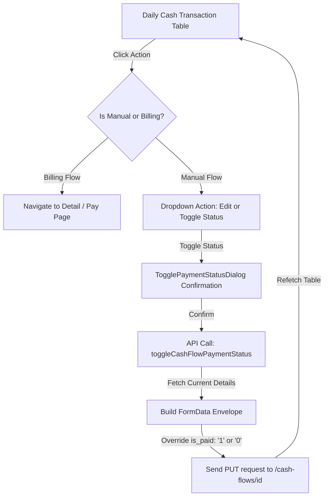
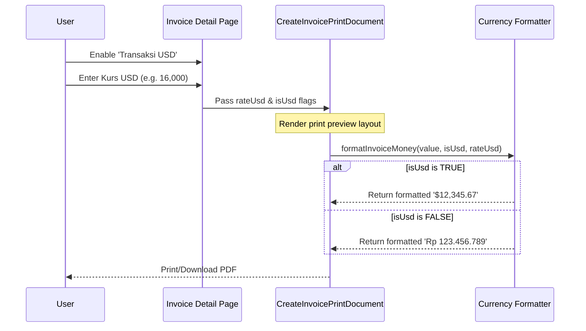

# Frontend Implementation & Changes Documentation
## PT Wajira Morindo Finance Dashboard

This document details the complete technical architecture, component structures, API integration mappings, and workflow flows implemented across the sprints.

---

## 1. Directory Structure & Folder Changes

The following files were introduced or modified during standardization and feature implementation:

```
src/
├── @types/
│   ├── kas-harian.types.ts       # Added is_paid, debet/credit original, USD values
│   └── finance-billing.types.ts  # Set unit_transaction_billing to nullable, mapped USD bills
├── scheme/
│   └── kas-harian.schema.ts      # Added optional is_paid boolean Zod validation rule
├── services/
│   ├── cashFlowService.ts        # Normalization mappers, forms serializer, toggle status callers
│   └── financeBilling.service.ts # Safe fallback mapping for nullable billing items and USD calculations
├── hooks/
│   └── useKasHarian.ts           # added useToggleKasHarianPaymentStatus react-query hook
└── components/
    └── features/
        └── kas-harian/
            ├── TogglePaymentStatusDialog.tsx # [NEW] Confirmation modal for payment statuses
            ├── KasHarianTable.tsx            # Integrated Status badges, column, and action triggers
            ├── KasHarianForm.tsx             # Integrated is_paid Checkbox component
            ├── AddKasHarianDialog.tsx        # Standardized with is_paid default values
            └── EditKasHarianDialog.tsx       # Standardized with is_paid state setters
```

---

## 2. API & Data Mapping Changes

### Interface & Payload Definitions
#### `src/@types/kas-harian.types.ts`
```typescript
export interface KasHarian {
  id: number;
  company_id: number;
  cash_id: number;
  account_id?: number | null;
  code: string;
  date: string;
  note: string;
  debet: number;
  debet_original?: number;
  credit: number;
  credit_original?: number;
  is_paid?: boolean;
  finance_billing?: {
    id: number;
    uuid?: string;
    unit_transaction_billing_id?: number | null;
    grand_total?: number;
  } | null;
}

export interface CashFlowPayload {
  company_id: number;
  cash_id: number;
  account_id: number;
  date: string;
  note: string;
  debet: number;
  credit: number;
  transaction_category: string;
  is_paid?: boolean;
}
```

### API Endpoint Integrations
1. **POST & PUT `/unit-transaction-item`**
   * Added `price_usd` and `price_per_unit_usd` support in type schema definitions.
2. **PUT `/cash-flows/{id}`**
   * Added `is_paid` flag submission (`'1'` or `'0'` string payload via `FormData` container).
   * Safe status mutation fetches the existing detail structure first to bypass strict body field validation rules on the backend.

---

## 3. Workflow Diagrams

### Finance Cash Flow & Status Toggle Flow


### Multi-Currency Printing Flow


---

## 4. State Management & Form Handling

Form validation is powered by **React Hook Form** integrated with **Zod Schemas**:

1. **Schema Validation (`src/scheme/kas-harian.schema.ts`)**:
   ```typescript
   export const kasHarianSchema = z.object({
     company_id: z.number().min(1),
     cash_id: z.number().min(1),
     account_id: z.number().min(1),
     date: dateField,
     note: z.string().trim().min(3),
     debet: z.number().min(0),
     credit: z.number().min(0),
     is_paid: z.boolean().optional(),
   });
   ```
2. **Controlled Numeric Fields**:
   Standardized price inputs strip any leading zeros on standard text field updates to prevent validation type schema mismatches:
   ```typescript
   if (/^0+[1-9]/.test(val)) {
     const stripped = val.replace(/^0+/, '');
     e.target.value = stripped;
     field.onChange(Number(stripped));
   }
   ```

---

## 5. Print Flow (Invoice PDF Documentation)

The invoice PDF generator in `CreateInvoicePrintDocument.tsx` calculates columns dynamically based on selected preferences:
*   **Currency Check**: Conditionally renders prefix symbol (`$` vs `Rp`).
*   **Conversion Summary Box**: Shows the conversion rate block (e.g., `*Kurs USD: 1 USD = Rp 16.000`) inside the payment instruction banner when `isUsd` is checked.
*   **Safety Fallbacks**: Null values on transaction details default back to Rp (IDR) to ensure that past invoices do not crash during PDF preview or print stages.

---

## 6. Testing Guide

### Testing Invoice Currency Toggles
1. Navigate to the Invoice Detail page.
2. Toggle the **"Transaksi USD"** checkbox.
3. Verify that the **"Kurs USD"** numeric input field displays with the default value `16.000`.
4. Change the rate, type item quantities, and verify that totals update dynamically.
5. Click **"Cetak Invoice"** to confirm that the PDF layout displays `$` columns and the Kurs Conversion note correctly.

### Testing Cash Flow Payment Status
1. Navigate to **Kas Harian** list page.
2. Confirm the **"STATUS"** column is present with badges `Lunas` (green) and `Belum` (amber).
3. Open the actions dropdown for any record, click **"Tandai Lunas"** or **"Tandai Belum Lunas"**.
4. Confirm the loading state trigger, verify success toast messages, and check that status badges reload in real time.

---

## 7. Known Limitations & Warnings

*   **Next.js Async Dynamic Imports**: Always bypass circular reference paths inside route authentication checks by using the native browser `fetch` API directly rather than importing interceptor instances.
*   **React Controlled Numeric Inputs**: Standard HTML `<input type="number">` retains typed leading zeros on state rerenders due to React DOM optimization limits. Custom validators must manually strip leading zeroes.
